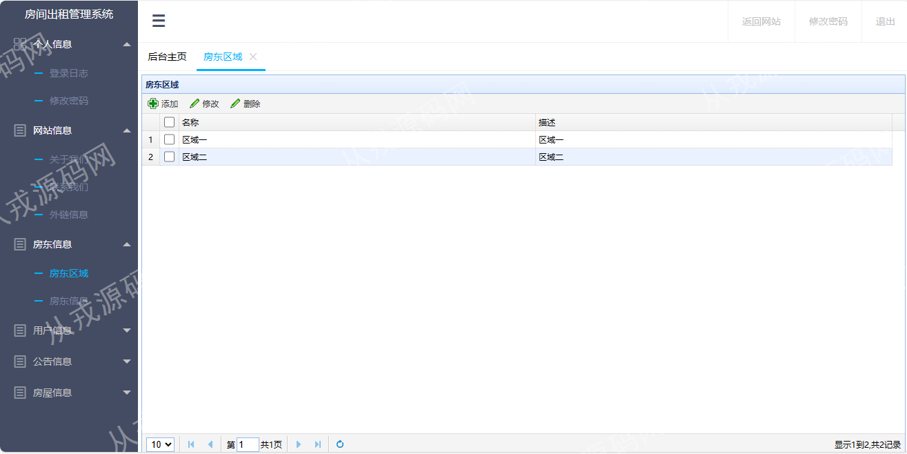
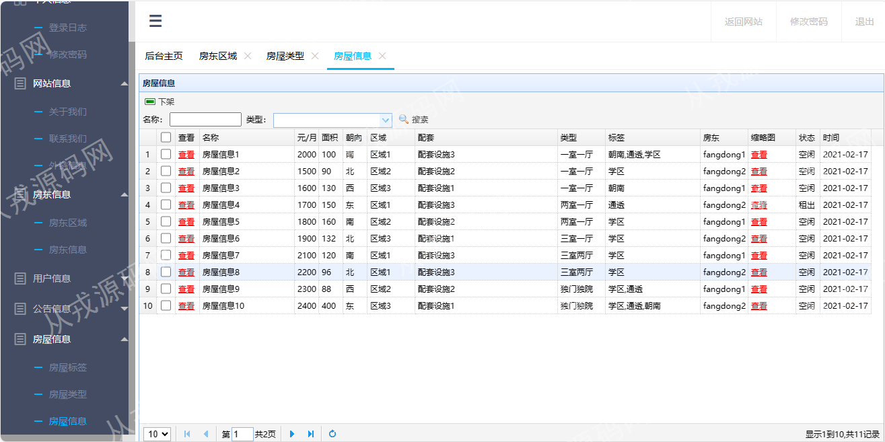

<h1 align="center">60.房屋出租管理系统</h1>

- <b>完整代码获取地址：从戎源码网 ([https://armycodes.com/](https://armycodes.com/))</b>
- <b>技术探讨、资料分享，请加QQ群：692619798</b> 
- <b>作者微信：19941326836  QQ：952045282</b> 
- <b>承接计算机毕业设计、Java毕业设计、Python毕业设计、深度学习、机器学习</b>
- <b>选题+开题报告+任务书+程序定制+安装调试+论文+答辩ppt 一条龙服务</b>
- <b>所有选题地址 ([https://github.com/YuLin-Coder/AllProjectCatalog](https://github.com/YuLin-Coder/AllProjectCatalog)) </b>

## 项目介绍
基于ssm的房屋出租管理系统：前端jsp、jquery、easyui，后端 springmvc、spring、mybatis，集成房屋列表、房屋详情浏览、租赁信息等功能于一体的系统。

## 功能介绍

### 管理员

- 个人信息：登录日志查询、日志删除、密码修改
- 网站信息：关于我们的查看和修改，联系我们查看和修改，外链信息的增删改查
- 房东信息：房东区域的增删改查，房东信息的查询和删除，房东信息通过操作和停用操作，关键词搜索，照片预览功能
- 用户信息：用户信息列表查询，关键词搜索，用户充值操作，用户意见列表查询，意见回复
- 公告信息：公告类型的增删改查、公告信息的增删改查、公告信息的缩略图上传
- 房屋信息：房屋标签的增删改查、房屋类型的增删改查、房屋信息列表查询、房屋信息关键词搜索、房屋信息详情查看、房屋信息下架

### 房东

- 基本功能：房东注册、登录、安全退出、密码修改
- 个人信息：个人信息查看、修改、上传照片
- 房屋信息：房屋信息的增删改查、上传房屋的缩略图照片
- 租赁信息：已经租赁房屋的列表查询、关键词搜索
- 退租信息：房屋退租列表查询、关键词搜索
- 交流信息：查看用户的房屋评论、针对用户的评论进行回复

### 用户

- 基本功能：用户注册、登录、安全退出、密码修改
- 网站前台页面：主导航栏、轮播图、房屋信息关键词搜索、房东信息列表、房屋信息列表、按房屋类型浏览、按房东区域浏览、公告信息查看等
- 个人中心：个人信息查看和修改，充值信息，意见信息的增删改查
- 租赁信息：房屋收藏列表、房屋租赁、房屋交流、已租赁列表、退租操作、退租列表查询、交流信息查询、各模块的关键词搜索

## 环境

- <b>IntelliJ IDEA 2021.3</b>

- <b>Mysql 5.7.26</b>

- <b>Tomcat 7.0.73</b>

- <b>JDK 1.8</b>

## 运行截图

